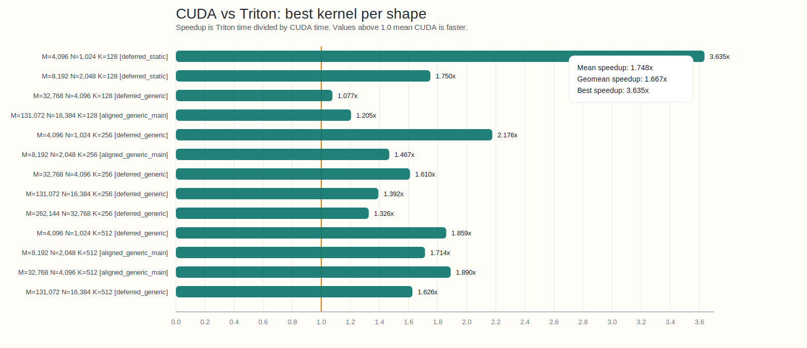
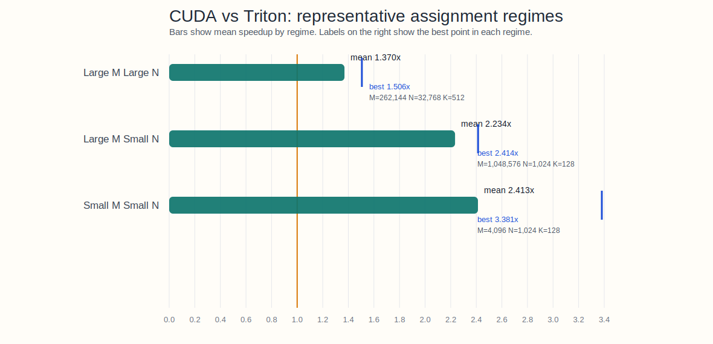

# Flash-KMeans

<p align="left">
| <a href="https://svg-project.github.io/"><b>Blog</b></a> | <a href="https://arxiv.org/abs/2603.09229"><b>Paper</b></a> | <a href="https://x.com/HaochengXiUCB/status/2033693755791052804"><b>Twitter/X</b></a> |
</p>

IO-aware batched K-Means clustering implemented with Triton GPU kernels. This repository provides the official K-Means implementation of [Sparse VideoGen2](https://arxiv.org/pdf/2505.18875).

This fork also carries CUDA flash-assign experiments for Ampere/Ada and Hopper GPUs under `flash_kmeans/csrc/`, split into `flash_kmeans/csrc/ampere/` and `flash_kmeans/csrc/hopper/`.


## Installation

Install flash-kmeans with `pip`:

```bash
pip install flash-kmeans
```

From source:

```bash
git clone https://github.com/svg-project/flash-kmeans.git
cd flash-kmeans
pip install -e .
```

## Usage

```python
import torch
from flash_kmeans import batch_kmeans_Euclid

x = torch.randn(32, 75600, 128, device="cuda", dtype=torch.float16)
cluster_ids, centers, _ = batch_kmeans_Euclid(x, n_clusters=1000, tol=1e-4, verbose=True)
```

We also provide a API interface similar to `faiss/sklearn`, see [API docs](https://github.com/svg-project/flash-kmeans/blob/main/flash_kmeans/interface.py) for details.

## Benchmark


We compare the performance of our Triton implementation with the following baselines:
  - [fast_pytorch_kmeans](https://github.com/DeMoriarty/fast_pytorch_kmeans) a Pytorch implmentation of K-Means clustering.
  - [fastkmeans(triton) / fastkmeans(torch)](https://github.com/AnswerDotAI/fastkmeans) another triton implementation of K-Means clustering. (and its Pytorch fallback)
  - flash-kmeans(triton) / flash-kmeans(torch): our implementation in Triton and Pytorch fallback.
  - batched torch kmeans: a naive batch implementation without considering OOM. 

Tested on NVIDIA H200 GPU with FP16 precision, 128 demensional data, varying number of clusters (k), data points (n) and batch size (b). Our Triton implementation brings significant performance improvements. 


Note: fastkmeans(triton) get error when k=100 or k=1000 in figure 1.

### Large tensor Benchmark

For large input that cannot fit in GPU memory, we compare the performance with fastkmeans(triton) with FP32 precision, 128 demensional data, number if data points scaling from 256K to 268M  (N = 2^18, 2^20, 2^22, 2^24, 2^26, 2^28) with cluster counts following K = √N (512, 1024, 2048, 4096, 8192, 16384).

Input tensor is generated randomly in CPU pinned memory. both flash-kmeans and fastkmeans transfer data from CPU to GPU in chunk and compute.


### CUDA

This repository also contains a CUDA flash-assign implementation based on the tensor-core pipeline from [Ampere-Gemm](https://github.com/teosssss/Ampere-Gemm).

#### CUDA Kernel

| Kernel | Main optimization ideas |
| --- | --- |
| `generic_main` | `cp.async` staging over `K`, WMMA tensor-core MMA, register-resident partial minima, shared-memory row reduction, and explicit tail handling for non-aligned shapes. |
| `aligned_generic_main` | Same pipeline as `generic_main`, but removes edge guards on aligned shapes so the load path is cheaper and more regular. |
| `aligned_static_main` | Adds compile-time specialization for common `D` values (`128/256/512`) so the compiler can unroll the inner loop more aggressively and simplify address arithmetic. |
| `deferred_generic` | Keeps the tiled tensor-core pipeline, but defers the row-min writeback so more of the reduction stays in registers before the final merge. |
| `deferred_static` | Combines deferred reduction with static-`D` specialization for the highest ceiling on common aligned shapes. |

#### Triton vs CUDA

We benchmarked these CUDA flash-assign kernels against the Triton `euclid_assign_triton` baseline on Modal with an NVIDIA L4 GPU, FP16 inputs, and a 13-shape sweep covering `D in {128, 256, 512}`. Here `N` is the number of points, `K` is the number of centroids, and `D` is the feature dimension.

Across this sweep, the best CUDA kernel per shape won on all 13 tested shapes:
  - mean speedup: `1.748x`
  - geometric-mean speedup: `1.667x`
  - best speedup: `3.635x` on `N=4,096, K=1,024, D=128`
  - worst speedup: `1.077x` on `N=32,768, K=4,096, D=128`

The strongest kernel is shape-dependent. `deferred_generic` remains the most reliable general-purpose variant, `deferred_static` wins the smallest `D=128` cases in this run, and `aligned_generic_main` is strongest on several aligned medium and large shapes.

A `3.635x` speedup here means `3.635x` over Triton, not over the older baselines above. Since Flash-KMeans Triton already reports up to `17.9x` over the best prior baselines, `33x` over cuML, and `200x+` over FAISS, this implies roughly `65.1x`, `120.0x`, and `727.1x` stacked speedups at the best point, or about `31.3x`, `57.7x`, and `349.6x` using the mean CUDA gain (`1.748x`). These stacked numbers are directional only, since the Triton paper results and this CUDA benchmark were not measured on the same hardware and benchmark suite.



The exact best-vs-best results from this Modal run are:

| Shape | Best CUDA kernel | CUDA ms | Triton ms | Speedup |
| --- | --- | ---: | ---: | ---: |
| `N=4,096 K=1,024 D=128` | `deferred_static` | 0.057 | 0.206 | 3.635x |
| `N=8,192 K=2,048 D=128` | `deferred_static` | 0.115 | 0.201 | 1.750x |
| `N=32,768 K=4,096 D=128` | `deferred_generic` | 0.769 | 0.828 | 1.077x |
| `N=131,072 K=16,384 D=128` | `aligned_generic_main` | 10.907 | 13.139 | 1.205x |
| `N=4,096 K=1,024 D=256` | `deferred_generic` | 0.091 | 0.197 | 2.176x |
| `N=8,192 K=2,048 D=256` | `aligned_generic_main` | 0.191 | 0.281 | 1.467x |
| `N=32,768 K=4,096 D=256` | `deferred_generic` | 1.370 | 2.206 | 1.610x |
| `N=131,072 K=16,384 D=256` | `deferred_generic` | 18.846 | 26.240 | 1.392x |
| `N=262,144 K=32,768 D=256` | `deferred_generic` | 74.662 | 99.031 | 1.326x |
| `N=4,096 K=1,024 D=512` | `deferred_generic` | 0.158 | 0.294 | 1.859x |
| `N=8,192 K=2,048 D=512` | `aligned_generic_main` | 0.380 | 0.652 | 1.714x |
| `N=32,768 K=4,096 D=512` | `aligned_generic_main` | 2.671 | 5.048 | 1.890x |
| `N=131,072 K=16,384 D=512` | `deferred_generic` | 36.332 | 59.092 | 1.626x |

This repository also includes a dedicated benchmark for rerunning or extending the comparison:

```bash
python3 examples/benchmark_cuda_vs_triton.py \
  --out-dir /path/to/output_dir
```

#### Hopper Experiments

Hopper-specific CUDA experiments live under [`flash_kmeans/csrc/hopper`](flash_kmeans/csrc/hopper/). The current kernels are additive and kept separate from the production Ampere/Ada path:

| Kernel | Main optimization ideas |
| --- | --- |
| `hopper_k5_k7_v1` | First Hopper bring-up using the non-persistent Kernel 5 structure from `fast.cu` with Kernel 7 `mbarrier` + TMA synchronization. |
| `hopper_k5_k7_wgmma256` | `m64n256k16` WGMMA path with triple-buffered TMA loads and deferred per-lane minima finalized after the centroid loop. |
| `hopper_k5_k7_wgmma256_persistent` | Persistent one-CTA-per-SM style scheduler over point tiles, keeping the same local-SMEM `A` and `B` path. |
| `hopper_k5_k7_wgmma256_persistent_cluster4` | Cluster size 4 persistent kernel that multicasts centroid `B` tiles to local SMEM across the cluster. |
| `hopper_k5_k7_wgmma256_persistent_cluster8` | Same multicast experiment at cluster size 8. |

The current Hopper experiments were benchmarked on Modal with an NVIDIA H100 GPU. They are still assignment-only kernels, not end-to-end k-means. On the aligned shapes tested so far:

- `hopper_k5_k7_wgmma256` is the strongest non-persistent baseline.
- `hopper_k5_k7_wgmma256_persistent` is usually flat to slightly better than the non-persistent version.
- cluster multicast (`cluster4` / `cluster8`) is correct on aligned shapes, but currently slower on larger workloads because cluster-wide barrier cost dominates the saved centroid loads.

Representative H100 results from `examples/benchmark_flash_assign_hopper.py`:

| Shape | Triton ms | `wgmma256` | `persistent` | `cluster4` | `cluster8` |
| --- | ---: | ---: | ---: | ---: | ---: |
| `N=4,096 K=1,024 D=128` | 0.036 | 0.016 | 0.016 | 0.017 | 0.017 |
| `N=8,192 K=2,048 D=256` | 0.047 | 0.037 | 0.037 | 0.039 | 0.039 |
| `N=16,384 K=2,048 D=512` | 0.154 | 0.058 | 0.057 | 0.112 | 0.114 |
| `N=32,768 K=4,096 D=256` | 0.230 | 0.137 | 0.135 | 0.277 | 0.282 |
| `N=32,768 K=4,096 D=512` | 0.582 | 0.217 | 0.216 | 0.425 | 0.428 |

You can rerun the Hopper sweep with:

```bash
python3 examples/benchmark_flash_assign_hopper.py \
  --mode assign-only \
  --cases 4096,1024,128 8192,2048,256 16384,2048,512 32768,4096,256 32768,4096,512 \
  --kernels hopper_k5_k7_wgmma256 hopper_k5_k7_wgmma256_persistent hopper_k5_k7_wgmma256_persistent_cluster4 hopper_k5_k7_wgmma256_persistent_cluster8
```

#### Representative Assignment Regimes

We also grouped assignment-only CUDA vs Triton results into three representative regimes, analogous to the workload breakdown used in the Flash-KMeans paper: `large-N large-K`, `large-N small-K`, and `small-N small-K`. This benchmark still measures only the assignment kernel, not end-to-end k-means.

On a reduced Modal L4 sweep, CUDA won on all tested shapes in every regime:

| Regime | Shapes | CUDA wins | Mean speedup | Geomean | Best speedup |
| --- | ---: | ---: | ---: | ---: | ---: |
| `large-N large-K` | 4 | 4/4 | 1.370x | 1.367x | 1.506x |
| `large-N small-K` | 4 | 4/4 | 2.234x | 2.225x | 2.414x |
| `small-N small-K` | 4 | 4/4 | 2.413x | 2.220x | 3.381x |

This regime view makes the trend clearer: the CUDA kernels still improve on Triton in large memory-intensive shapes, but the strongest gains show up in the lower-`N` or lower-centroid-count regimes where the CUDA path sustains much higher assignment throughput.




## Citation

If you use this codebase, or otherwise found our work valuable, please cite:

```
@article{yang2026flash,
  title={Flash-KMeans: Fast and Memory-Efficient Exact K-Means},
  author={Yang, Shuo and Xi, Haocheng and Zhao, Yilong and Li, Muyang and Fan, Xiaoze and Zhang, Jintao and Cai, Han and Lin, Yujun and Li, Xiuyu and Keutzer, Kurt and others},
  journal={arXiv preprint arXiv:2603.09229},
  year={2026}
}

@article{yang2025sparse,
  title={Sparse VideoGen2: Accelerate Video Generation with Sparse Attention via Semantic-Aware Permutation},
  author={Yang, Shuo and Xi, Haocheng and Zhao, Yilong and Li, Muyang and Zhang, Jintao and Cai, Han and Lin, Yujun and Li, Xiuyu and Xu, Chenfeng and Peng, Kelly and others},
  journal={arXiv preprint arXiv:2505.18875},
  year={2025}
}
```
